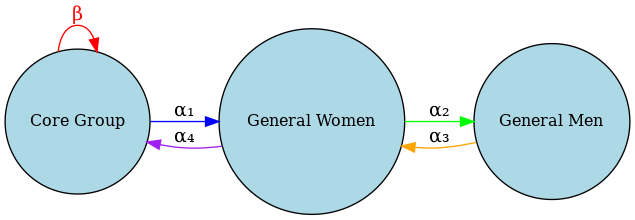
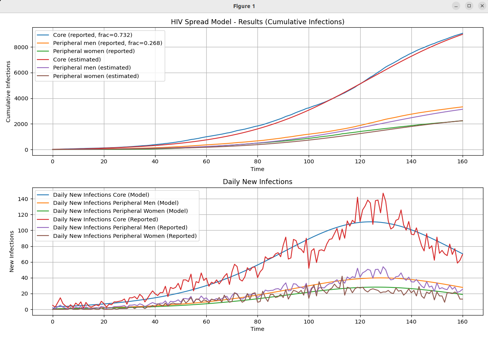

# Transmission Model — Core & General Population

I've extracted the data from the official Hong Kong STD update for years 2003-2024 and implemented a **compartmental ODE-based model** to simulate and fit the dynamics of HIV transmission across two interacting groups:

- **Core group** (MSM - men who have sex with other men)
- **General population** (women and other men)

It uses [torchdiffeq](https://github.com/rtqichen/torchdiffeq) to solve the system of differential equations and optimizes model parameters to fit real historical data.

---

## Model Overview

### **Compartments:**

| Variable        | Description                                 |
|----------------|---------------------------------------------|
| `S`            | Susceptible individuals in the core group    |
| `I`            | Infected individuals in the core group       |
| `C`            | Cumulative infections in the core group      |
| `I_gm`         | Infected men in the general population       |
| `C_gm`         | Cumulative infections in general men         |
| `I_gw`         | Infected women in the general population     |
| `C_gw`         | Cumulative infections in general women       |

### **Populations:**

- Core group: \( N_c = 90,000 \)
- General men: \( N_gm = 4,500,000 \)
- General women: \( N_gw = 4,500,000 \)

---

## HIV Transmission Model

The diagram below illustrates the transmission dynamics between the core group and the general population:



---

## Differential Equations

The dynamics of HIV transmission are modeled with the following ODEs:

```math
\frac{dS}{dt}     = -\beta \cdot \frac{S I}{N_c} - \alpha_4 \cdot \frac{S I_{gw}}{N_c}
```

```math
\frac{dI}{dt}     = \beta \cdot \frac{S I}{N_c} + \alpha_4 \cdot \frac{S I_{gw}}{N_c} - \mu I
```

```math
\frac{dC}{dt}     = \beta \cdot \frac{S I}{N_c} + \alpha_4 \cdot \frac{S I_{gw}}{N_c}
```

```math
\frac{dI_{gm}}{dt} = c_{mw} \cdot \frac{S_{gm}}{N_{gm}} \cdot \frac{I_{gw}}{N_{gw}} \cdot \alpha_2 - \mu I_{gm}
```

```math
\frac{dI_{gw}}{dt} = \alpha_1 \cdot \frac{S_{gw} I}{N_{gw}} + c_{mw} \cdot \frac{S_{gw}}{N_{gw}} \cdot \frac{I_{gm}}{N_{gm}} \cdot \alpha_3 - \mu I_{gw}
```


---

## Parameters

| Parameter  | Meaning                                                |
|------------|--------------------------------------------------------|
| `beta`     | Core-to-core transmission rate                         |
| `alpha1`   | Transmission from core to general women                |
| `alpha2`   | Transmission from general women to general men         |
| `alpha3`   | Transmission from general men to general women         |
| `alpha4`   | Transmission from general women to core group          |
| `c_mw`     | Quarterly number of contacts between general men and women      |
| `mu`       | Recovery/removal rate                                  |

All parameters are **learnable**, including the `core_fraction` parameter (fraction of `M` belonging to the core group).

---

## Data Handling

- The model expects historical quarterly HIV incidence data:
  - `F`: New cases among women
  - `M`: New cases among men

- Data is split into:
  - **Core group:** A learned fraction of `M`
  - **General men:** Remaining `M`
  - **General women:** `F`

- Cumulative incidence is computed using `torch.cumsum`.

---

## Training

- The `train()` function:
  - Initializes the model
  - Solves the ODEs using `torchdiffeq.odeint`
  - Computes predicted quarterly new infections quarter-by-quarter
  - Minimizes RMSE loss between predicted and actual quarterly new infections

---

## Output

- Plots of cumulative and daily new infections:
  - Core (true vs. estimated)
  - General men (true vs. estimated)
  - General women (true vs. estimated)

- Final learned parameters printed at the end



The final "trained" proportion of MSM among the infected is 73.2%, which is slightly higher than the reported 72%. The difference can perhaps be explained
by a small percentage of false reporting due to shame, stigma etc.

---

## Dependencies

- `torch`
- `torchdiffeq`
- `pandas`
- `matplotlib`
- `numpy`
